# Bee Tagger

Standalone (Python stdlib only, no Remi files needed):

    python3 server.py --port 8002      # then open http://localhost:8002
    # remote: ssh -L 8002:localhost:8002 <host>

Click **Open CSV…** and type/browse to a tracks CSV. Images load from its `crop_filepath` column
(fallback: `<csv folder>/crops/<crop_filename>`). Source CSVs are never modified.
Labels autosave to `labels/<dataset>.json`; **Export CSV** writes `labels/<dataset>.tagged.csv` with
`track_key_sam, tag_color(+_source), tag_number(+_source), tag_rotation, pred_*` columns (rows added by Merge included).

## Tabs
- **Tag** – color buttons + numbers 1–100, per track. Select tracks (click / shift / ctrl), then a color button
  (default hotkeys `Q W E R…`; right-click a color button → **Hotkey** to rebind), or type digits + Enter (or number box / Grid). Double-click opens a track; inside, buttons tag the
  whole track and right-click an image tags only that image (color and/or number).
  Right-click a color button to rename/recolor/reorder/delete. Ctrl+Z undoes.
- **Inference** – run your model, then review: sort by lowest confidence, filter "needs review",
  `A` accepts the prediction, or fix by hand with the same buttons.
- **Merge** – pick another CSV; rows with the same `crop_filepath` get their color / number / rotation copied in
  (source column names are auto-detected, e.g. `Tag_color`, `ground_truth_numbers`, `tag_rotation`; type the name if not
  found). Optionally add rows not in the current CSV (their `track_id`s are renumbered to be unique per video; they are stored
  in `labels/<dataset>.extra.csv`, the source CSV is untouched). "Undo last merge" restores the pre-merge state.
- **Rotation** – every image that has a color + number, one at a time. `A`/`S` rotate left/right by the step (default 15°),
  `Z`/`X` or Ctrl+A / Ctrl+S / Ctrl+click = 1°, Enter saves and goes to the next. Saved as `tag_rotation` (degrees clockwise)
  in the export.
- **Distribution** – tagged totals, color bars, number histogram stacked by color; click bars / set a number
  range to cross-filter; toggle Images vs Tracks.

## How to use

A step-by-step guide for first-time users. The screenshots use made-up demo crops, not real bee data.

**Contents:** [The idea](#the-idea-in-30-seconds) · [1. Start](#1-start-the-app-and-open-your-data) · [2. Screen tour](#2-a-tour-of-the-screen) · [3. Tag tab](#3-the-tag-tab-where-you-will-spend-most-of-your-time) · [4. Inside a track](#4-inside-a-track-tagging-single-images) · [5. Inference](#5-inference-tab-let-a-model-do-the-first-pass) · [6. Distribution](#6-distribution-tab-see-what-you-have-tagged) · [7. Merge](#7-merge-tab-bring-in-labels-from-another-csv) · [8. Rotation](#8-rotation-tab-record-which-way-is-up) · [9. Export](#9-export-your-results) · [Cheat sheet](#keyboard--mouse-cheat-sheet) · [Troubleshooting](#troubleshooting)

### The idea in 30 seconds

The CSV you open lists many small pictures ("crops") of bees. Crops of the **same bee in consecutive video frames** are grouped into a **track**. Every bee wears a tag with a **color** and a **number (1–100)**, and your job is to record both.

- You normally tag a **whole track at once** (one decision covers all its images).
- If a single image in a track is different (for example a mis-tracked frame), you can give that one image its own tag. This is called an **image override**.
- **Everything saves automatically** the moment you change it. There is no Save button, and you can close the browser at any time without losing work.
- Your original CSV is **never modified**. Results go to a separate file when you press **Export CSV**.

### 1. Start the app and open your data

**a) Start the server** (Python 3 only, nothing to install):

    python3 server.py --port 8002

Then open <http://localhost:8002> in a browser. On a remote machine, first run `ssh -L 8002:localhost:8002 <host>` on your own computer, then open the same address locally.

**b) Open a CSV.** The first time, you will see a welcome screen with an **Open a tracks CSV…** button:

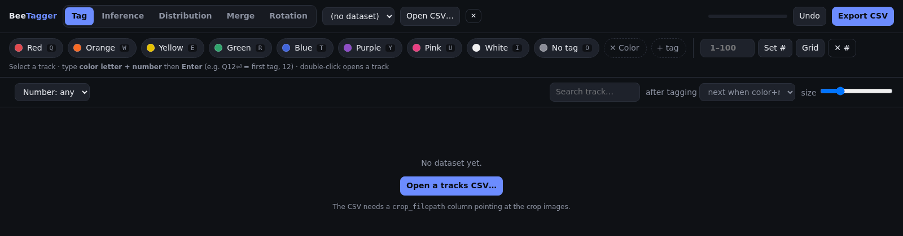

A file chooser opens. You can **type or paste the full path** of your CSV in the box, or **browse**: click a folder to enter it, click `..` to go up, click a `.csv` file to put its path in the box (double-click opens it directly). Then press **Select** (or Enter).

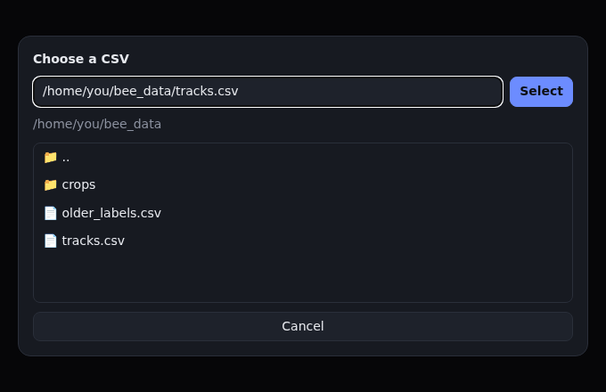

Requirements for the CSV:
- It must have a **`crop_filepath`** column with the location of each image. If that column does not work, the app also tries `<csv folder>/crops/<crop_filename>`.
- Crops are grouped into tracks using the file name pattern `…T<track number>_F<frame number>…` (for example `capture-a.mp4.T0004_F0010.png`). If the names don't follow that pattern, the `video_name` and `track_id` columns are used instead.

If the images don't show up, the app tells you *"Couldn't find images at the CSV's crop_filepath…"*. See [Troubleshooting](#troubleshooting).

> **Known issue in this version:** once a dataset is already open, the **Open CSV…** button in the top bar may do nothing when you press **Select** (the browser console shows `onPick is not a function`). Workaround: open the browser's developer console (F12 → *Console*), type `openModal()` and press Enter. The same dialog appears and works normally. (The welcome-screen button is not affected.) Remove this note once the bug is fixed.

You can open several CSVs. Switch between them with the **dataset dropdown** at the top. The small **✕** next to *Open CSV…* only removes the dataset from the dropdown; your CSV and your labels are kept on disk.

### 2. A tour of the screen

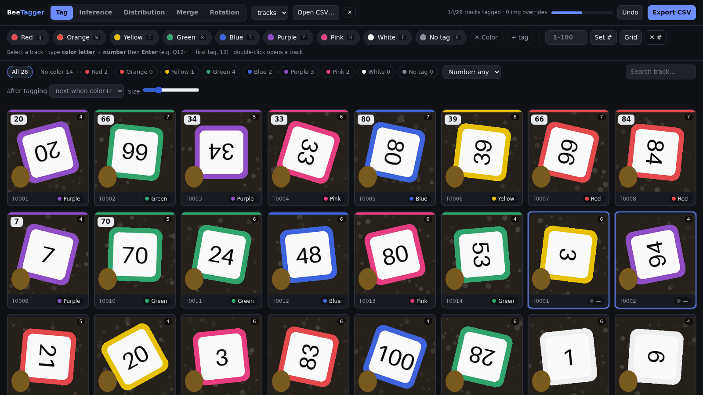

From top to bottom:

| Area | What it is |
|---|---|
| **Tabs** (Tag · Inference · Distribution · Merge · Rotation) | The five working modes, explained in the sections below. Start on **Tag**. |
| **Dataset dropdown / Open CSV… / ✕** | Switch, open or forget a dataset. |
| **Progress bar and counter** | *"14/28 tracks tagged · 0 img overrides"*: tracks that have a color or a number, and how many single images have their own tag. |
| **Undo** | Takes back your last change (same as **Ctrl+Z**). You can undo many steps in a row. |
| **Export CSV** | Writes your results to a new CSV file ([see Export](#9-export-your-results)). |
| **Color buttons** (Red, Orange, … with a small letter such as `Q`) | Click one to give the selected track(s) that color. The letter is its keyboard shortcut. |
| **✕ Color** / **+ tag** | Remove the color from the selection / create a new color button. |
| **Number box, Set #, Grid, ✕ #** | Give the selection a number from 1 to 100 / remove the number. |
| **Filter chips** (*All, No color, Red 2, …*) | Show only tracks with a certain color. The count is shown on each chip. |
| **Number dropdown** | Filter by number: *any*, *Has number*, *No number*, or *Number =* a value. |
| **Search track…** | Shows tracks whose name contains the text you type (for example `T0012`). |
| **after tagging** | What happens after you tag a single track: *next when color+number set* (default), *next after any tag*, or *stay*. |
| **size slider** | Makes the pictures bigger or smaller. |

**What a picture card shows:**
- A **colored strip** on top of the card: the track's color (no strip = no color yet).
- A **white number badge** at the top left: the track's number (no badge = no number yet).
- A **small counter** at the top right: how many images the track contains.
- At the bottom: the track name, the color name, and **"N ovr"** if some of its images have their own tag.
- A **blue outline** means the card is selected.

### 3. The Tag tab: where you will spend most of your time

#### Step 1: choose which track(s) to tag

| Do this | Result |
|---|---|
| **Click** a card | Selects just that track. |
| **Shift + click** another card | Selects every card between the first and second click. |
| **Ctrl + click** (⌘ + click on Mac) | Adds or removes one card without losing the rest of your selection. |
| **Arrow keys** ← → ↑ ↓ | Move the selection one card at a time (up/down jump a whole row). |
| **Esc** | Clears the selection. |

Tagging several selected tracks at once is a fast way to handle tracks you are sure are the same (for example, 5 tracks you can see are all "Red").

#### Step 2: give them a color

Pick **one** of these. They all do the same thing:

1. **Click a color button** in the bar at the top.
2. **Press its shortcut letter**, then **Enter** (see the keyboard method below).
3. **Right-click** a track card and choose a color from the menu.

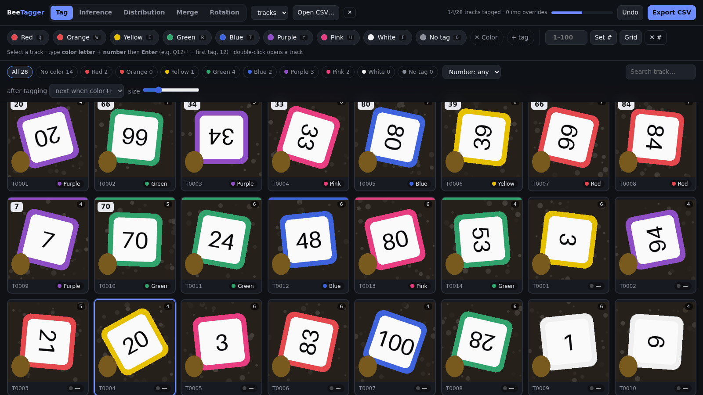

The default shortcuts follow the order of the buttons: **Q W E R T Y U I O P**, so the first button is `Q`, the second `W`, and so on. The letter is printed on each button, so you never have to remember them. With the default palette: Red `Q`, Orange `W`, Yellow `E`, Green `R`, Blue `T`, Purple `Y`, Pink `U`, White `I`, No tag `O`.

The **No tag** button is a real label for bees that carry no tag. It is *not* the same as leaving a track untagged. To **remove** a color, use **✕ Color** (or the **Delete** key).

#### Step 3: give them a number (1–100)

1. **Number box:** click the box, type a number, press **Enter** (or click **Set #**).
2. **Grid:** click **Grid** and click a number from the 1–100 board.

   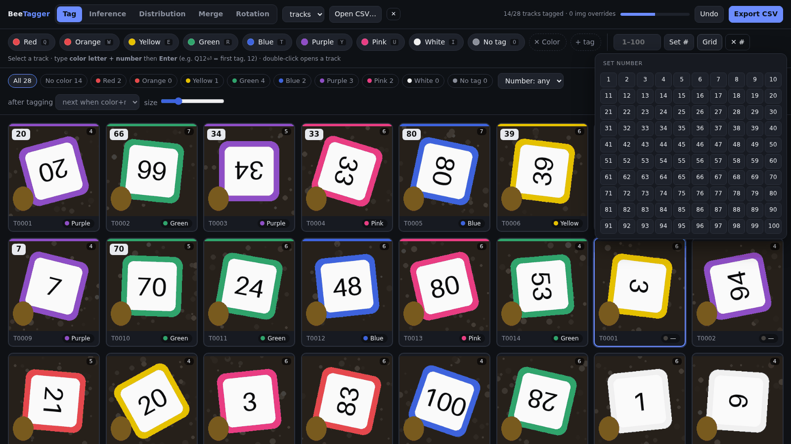
3. **Keyboard:** just type digits (see next section).
4. **✕ #** removes the number.

Numbers must be between **1 and 100**. Anything else is refused with a message.

#### The fast way: color and number with the keyboard only

Once you have selected a track, you can do everything without touching the mouse:

1. Press the **color shortcut letter** (for example `Q` for the first color).
2. Type the **number** (up to 3 digits, for example `1` then `2`).
3. Press **Enter**.

While you type, a box appears in the bottom-right corner showing what you are about to apply. **Nothing is applied until you press Enter.**

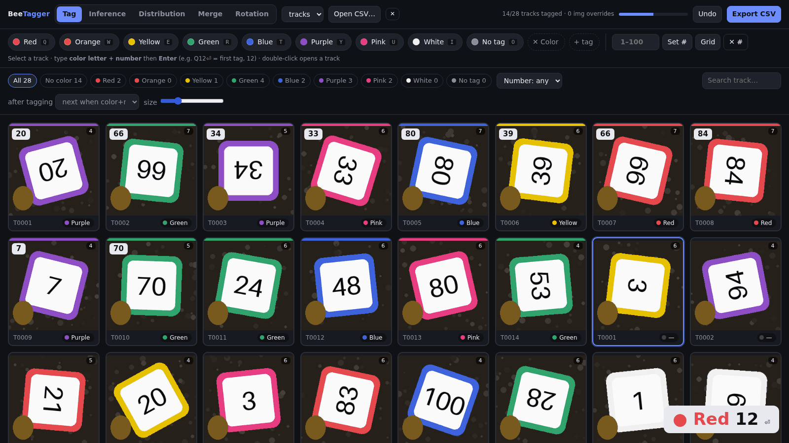

- **Q 1 2 Enter** = color #1 (Red) and number 12.
- You can also send only a color (`T` Enter) or only a number (`4` `7` Enter).
- **Backspace** removes the last digit you typed (then the color if no digits are left).
- **Esc** cancels what you have typed without applying anything.
- After **Enter**, the app **automatically moves to the next track**, so you can keep typing: `Q12⏎ T7⏎ Y45⏎ …`

> **Tip:** the keyboard shortcuts are switched off while a text box (Search, number box…) has the cursor, so you can type normally there. If the shortcuts seem dead, click on an empty part of the page first.

#### Moving to the next track automatically

The **after tagging** dropdown controls what happens when you tag *one* selected track using the buttons:

- **next when color+number set** (default): the selection moves on once the track has both a color and a number.
- **next after any tag**: moves on after every single tag (color or number).
- **stay**: never moves on by itself.

Tagging with the keyboard + Enter always moves on to the next track. Nothing moves when several tracks are selected.

#### Changing the color buttons (names, colors, shortcuts)

**Right-click** a color button to edit it:

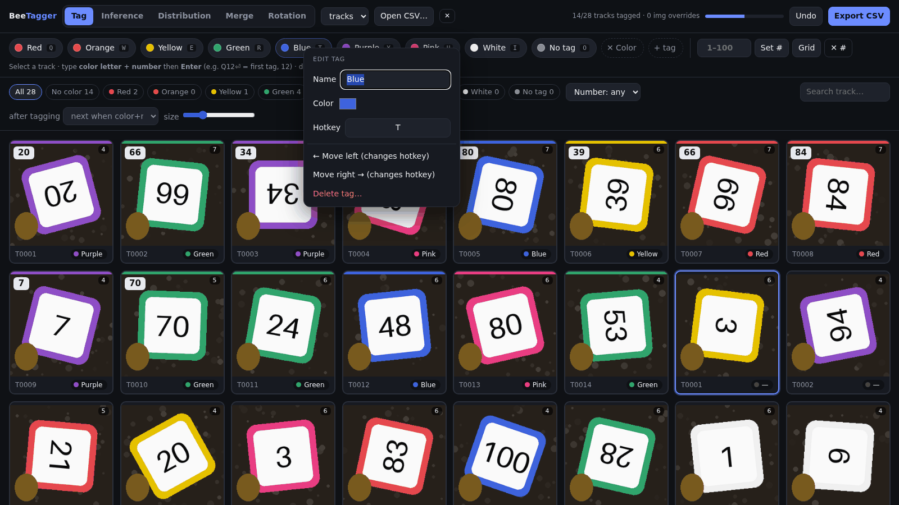

- **Name:** rename it (press Enter to confirm).
- **Color:** choose a different display color.
- **Hotkey:** click the box, then press the key you want (a letter or symbol; digits are reserved for numbers). **Backspace/Delete** removes the shortcut. If another color already used that key, it loses it.
- **Move left / Move right:** reorder the buttons. This also changes the default shortcuts, which follow the order.
- **Delete tag…:** removes the button. You are asked to confirm, and every label using that color is cleared (numbers are kept).

**+ tag** creates a new color button (you type its name and a color is picked for you; change it afterwards with a right-click). The palette is **shared by all datasets**.

#### Finding tracks quickly

- Click **filter chips** to see only certain colors. **No color** shows what you still have to do.
- Use the **Number** dropdown to find tracks with or without numbers.
- Type part of a name in **Search track…**.
- Use the **size** slider to see more, smaller pictures at once, or fewer, larger ones when numbers are hard to read.

#### Fixing a mistake

Press **Ctrl+Z** (or **Undo**). Every tagging action, including rotation saves and accepted predictions, can be undone step by step. (Undo history is cleared when you reload or switch the dataset, but the labels themselves stay saved.)

### 4. Inside a track: tagging single images

**Double-click** a card (or select it and press **Enter**) to open the track and see every image in it.

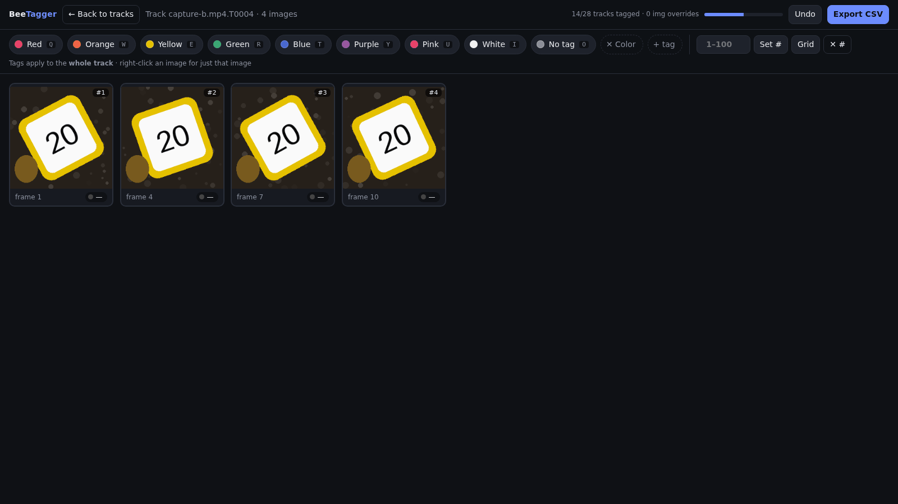

*(Top bar: **← Back to tracks**, the track name and image count.)* Here:

- The color buttons, number box, grid and keyboard shortcuts tag the **whole track**, exactly like in the gallery. If some images had their own override, the whole-track tag replaces it for that field.
- **Right-click a single image** to tag **only that image**:

  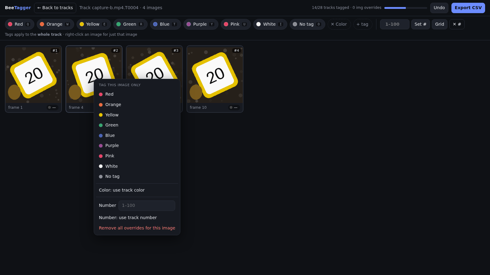

  - Pick a color to give this image its own color.
  - Type a **Number** and press Enter for its own number.
  - **Color: use track color** / **Number: use track number** remove just that override.
  - **Remove all overrides for this image** puts it back to following the track.
- Images with their own tag get a **dashed outline** and an **"image override"** badge.
- To go back: click **← Back to tracks**, press **Esc**, or press **Backspace**. You return to where you were in the list.

Use overrides sparingly, only when one image really differs from the rest of its track.

### 5. Inference tab: let a model do the first pass

The Inference tab runs **your own model** on the images and lets you review its guesses, instead of tagging everything from scratch. You first need a small Python file that wraps your model; see [Plugging in your model](#plugging-in-your-model) below. The included `models/example_model.py` returns random guesses, which is good for trying the screen out.

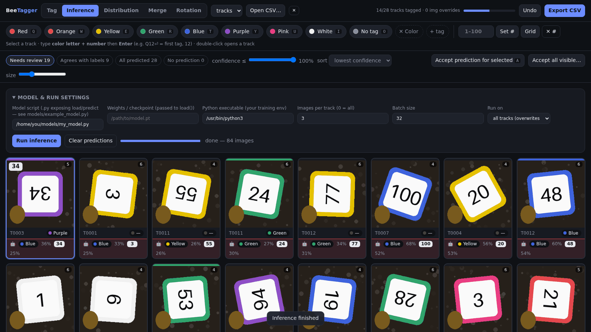

**Run it**

1. Open the **Inference** tab. The **Model & run settings** panel appears.
2. Fill in:
   - **Model script:** the `.py` file that has the `predict` function.
   - **Weights / checkpoint:** optional file passed to your `load()` function.
   - **Python executable:** the Python of the environment where your model's libraries are installed (for example a conda env). Leave the default to use the same Python as the server.
   - **Images per track:** how many images per track to run on (spread evenly over the track). `0` = all images. Fewer is much faster.
   - **Batch size:** how many images are sent to the model at once.
   - **Run on:** *all tracks* (replaces earlier predictions) or *only tracks missing a color or number*.
3. Click **Run inference**. A progress bar shows how far it is. **Stop** interrupts it. If your script fails, the error is shown next to the bar, marked with ⚠.
4. When it finishes, predictions appear on the cards. **Clear predictions** deletes them (after asking for confirmation).

**Read the results.** Each card has an extra robot line 🤖 with the model's color, its **confidence** (percentage), and its number with confidence. The line is **green** if it agrees with what you have labeled and **red** if it differs (a track you have not labeled yet counts as different). Predictions from all images of a track are combined into one guess per track.

**Review them efficiently**

- **Filter chips:** *Needs review* (prediction differs from your label, or you haven't labeled it yet; this is the default), *Agrees with labels*, *All predicted*, *No prediction*.
- **confidence ≤ slider:** show only tracks where the model is *less* sure than the chosen percentage.
- **sort:** *lowest confidence first* (default: most doubtful first), *highest confidence first*, or *track order*.
- If the model is **right**, select the card and press **A** (or click **Accept prediction for selected**). It copies the model's color and number onto the whole track, and the card leaves the "Needs review" list.
- If the model is **wrong**, tag it yourself exactly as in the Tag tab (buttons, or `Q12⏎`).
- **Accept all visible…** accepts every track currently shown (you are asked to confirm), which is handy after filtering to high-confidence guesses. Accepting **overwrites** labels you already set on those tracks, so check the filter first.
- Right-click a card → **Accept model prediction** does the same for the selection.
- Selection (click, Shift, Ctrl, arrows), opening a track (double-click / Enter) and Ctrl+Z all work as in the Tag tab.

### 6. Distribution tab: see what you have tagged

Use this tab to check progress and to spot imbalances (for example, too few examples of a color or number).

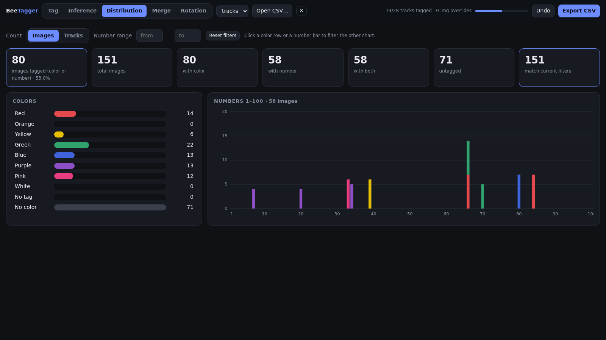

- **Boxes at the top:** how many images/tracks are tagged, total, with a color, with a number, with both, untagged, and how many match your current filters.
- **Colors (left):** one bar per color. **Click a bar** to filter the chart on the right to that color. Click several to combine. Click again to deselect.
- **Numbers 1–100 (right):** a histogram, with each bar stacked by color. **Click a bar** to select that number (click it again to clear). Hover to see the exact counts.
- **Number range from … to …:** type two numbers to look only at that range.
- **Images / Tracks:** switch between counting images or whole tracks. With *Images*, every image counts once, using its own override if it has one.
- **Reset filters** clears all selections.

### 7. Merge tab: bring in labels from another CSV

Use this if you (or someone else) already tagged the same images in a different CSV and you want to reuse those labels. Rows are matched by **`crop_filepath`**, so both files must refer to the same image paths.

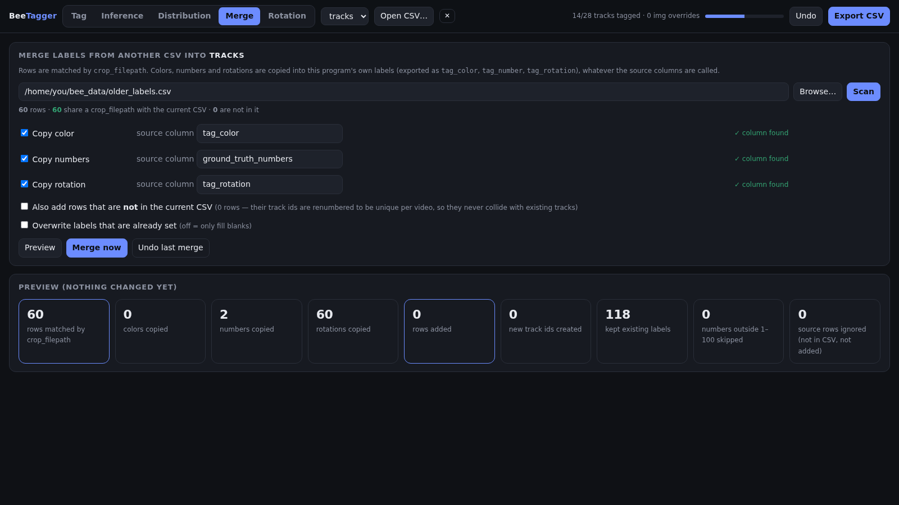

1. **Choose the other CSV:** type its path (or click **Browse…**) and click **Scan**.
2. The app reports how many rows it found, **how many match** your current CSV, and how many are not in it.
3. For **color**, **numbers** and **rotation**, tick what you want to copy. The **source column** is guessed automatically (for example `tag_color`, `ground_truth_numbers`, `tag_rotation`). A green **✓ column found** means it worked; an orange **⚠** means you must type the right column name yourself.
4. Optional checkboxes:
   - **Also add rows that are not in the current CSV:** imports those extra images too. Their track numbers are renumbered so they never clash with existing tracks. They are stored in `labels/<dataset>.extra.csv`.
   - **Overwrite labels that are already set:** off (default) only fills blanks, so your existing work is safe.
5. Click **Preview**. It shows what *would* happen (colors, numbers and rotations copied, rows added, labels kept…) **without changing anything**.
6. Happy with it? Click **Merge now** and confirm.
7. Changed your mind? Click **Undo last merge**. It restores the labels as they were just before the last merge (only the most recent merge can be undone).

Color names in the other file that don't exist in your palette are created automatically as new color buttons.

### 8. Rotation tab: record which way is up

Some tags are photographed rotated or upside down. This tab lets you record, for each image, how many degrees it must be turned **clockwise** so that the number reads upright. It is saved as **`tag_rotation`** in the export.

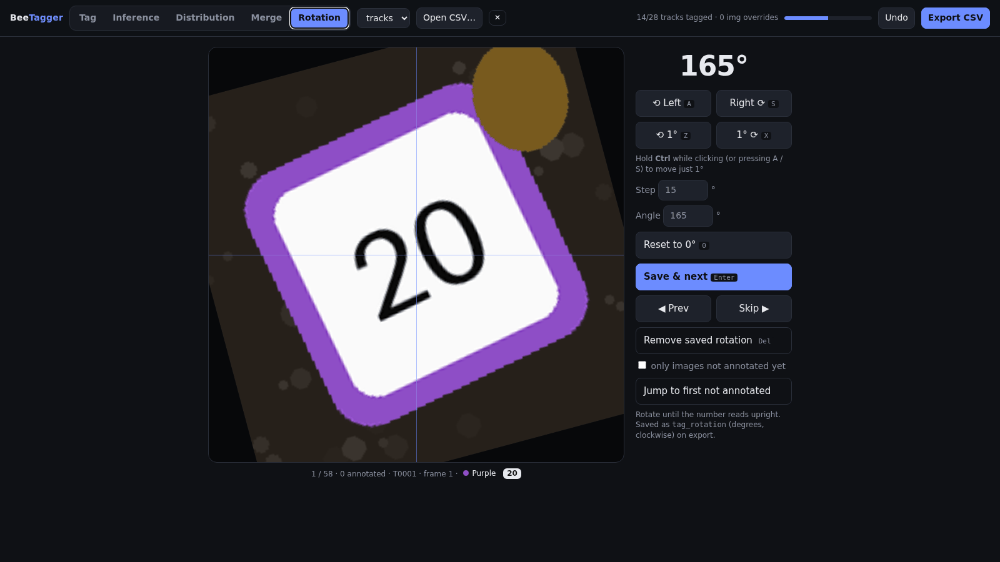

The tab shows, **one at a time**, every image that already has **both a color and a number** (tag some in the Tag tab first). The picture is shown large, with a thin **crosshair** to help you judge what is straight. The big number is the current angle.

**Workflow:** turn the image until the number looks upright, then press **Enter**. The angle is saved and the next image appears.

| Action | Keyboard | Mouse |
|---|---|---|
| Rotate **left** (counter-clockwise) by the *step* (default 15°) | **A** | **⟲ Left** |
| Rotate **right** (clockwise) by the *step* | **S** | **Right ⟳** |
| Rotate left / right by exactly **1°** | **Z** / **X** | **⟲ 1°** / **1° ⟳** |
| Rotate by 1° using the big buttons | **Ctrl + A** / **Ctrl + S** | **Ctrl + click** the Left / Right button |
| Reset the angle to 0° | **0** | **Reset to 0°** |
| **Save and go to the next** image | **Enter** | **Save & next** |
| Go to the previous / next image **without saving** | **←** / **→** | **◀ Prev** / **Skip ▶** |
| Delete the saved rotation of this image | **Delete** | **Remove saved rotation** |
| Undo the last save | **Ctrl + Z** | **Undo** (top bar) |

Other controls on the right:
- **Step:** change the size of the big rotation step (default 15°).
- **Angle:** type an exact value (half degrees are allowed).
- **Only images not annotated yet:** hides the images that already have a rotation, so you only see what's left.
- **Jump to first not annotated:** goes straight to the first unfinished image.
- The caption under the picture shows your position (*1 / 58*), how many are done, the track, frame, color and number, and *saved 165°* if a rotation already exists.

### 9. Export your results

Click **Export CSV** (top right). The app writes a **new** file and tells you where:

    labels/<dataset>.tagged.csv

It contains all the columns of your original CSV plus:

| Column | Meaning |
|---|---|
| `track_key_sam` | The track this row belongs to. |
| `tag_color`, `tag_number` | The final color name and number for the image. |
| `tag_color_source`, `tag_number_source` | `track` (inherited from the whole track) or `image` (this image's own override). Empty = not tagged. |
| *your own classes* | Click **⚙ Classes** in the palette to rename the color/number output columns, hide them, or add any number of extra *choice* classes (e.g. `has_pollen`: Yes/No) and *number* classes (e.g. `pollen_count`). Each is tagged from the palette (and the right-click menus) and exported as `<column>` plus `<column>_source`. |
| `tag_rotation` | Degrees clockwise from the Rotation tab (empty if not set). |
| `pred_color`, `pred_color_conf`, `pred_number`, `pred_number_conf` | The model's prediction and confidence, if you ran inference. |

You can export as often as you like; the file is overwritten with the latest state. Rows added by **Merge** are included.

**Where everything is stored.** All files live in the `labels/` folder next to `server.py` (set the `BEETAGGER_LABELS` environment variable to use another folder):

| File | Contents |
|---|---|
| `<dataset>.json` | Your labels (autosaved on every change). |
| `_tags.json` | The color buttons. |
| `_datasets.json` | The list of opened CSVs. |
| `<dataset>.pred.json` | Model predictions. |
| `<dataset>.extra.csv` | Rows added by Merge. |
| `<dataset>.tagged.csv` | The last export. |
| `backups/` | Copy of your labels taken before each merge (used by *Undo last merge*). |

Back up the `labels/` folder to keep your work safe.

### Keyboard & mouse cheat sheet

**Tag and Inference tabs**

| Key / action | What it does |
|---|---|
| Click / Shift+click / Ctrl+click | Select one / a range / add or remove one track |
| ← → ↑ ↓ | Move the selection |
| Double-click, or **Enter** (nothing typed) | Open the selected track |
| Color letter (default **Q W E R T Y U I O P**) | Start a tag with that color |
| Digits **0–9** (max 3) | Start/extend a number |
| **Enter** | Apply the typed color and/or number, then go to the next track |
| **Backspace** | Remove the last typed digit (then the color); inside a track with nothing typed: go back |
| **Esc** | Cancel typing; else close a menu/dialog; else go back from a track; else clear the selection |
| **Delete** | Remove the color from the selection |
| **A** (Inference tab) | Accept the model's prediction for the selected track(s) |
| **Ctrl+Z** | Undo |
| Right-click a card / color button / image | Tag menu / edit color button / tag one image |

**Rotation tab:** see the table in [section 8](#8-rotation-tab-record-which-way-is-up).

### Troubleshooting

| Problem | What to do |
|---|---|
| Pictures are blank, or *"Couldn't find images at the CSV's crop_filepath"* | The paths in `crop_filepath` don't exist on the machine running `server.py`. Fix the paths in the CSV, or put the images in a `crops` folder next to the CSV with the names from `crop_filename`. |
| *"Number must be 1–100"* | Numbers 0, above 100, or empty are not valid. |
| Keyboard shortcuts do nothing | A text box probably has focus: click an empty part of the page. Also make sure you are not on the Distribution or Merge tab, where tagging shortcuts are off. |
| *"Select a track first"* | Click a track before pressing a color or number. |
| Open CSV… button does nothing | See the [known issue](#1-start-the-app-and-open-your-data) above. |
| Inference says *"a job is already running"* | Wait for it to finish or press **Stop**. |
| Inference shows a ⚠ error message | The message comes from your model script (for example a missing library or a wrong weights path). Check the *Python executable* matches the environment where your model works. |
| Merge says *"column … not found"* | Type the exact name of the column from the other CSV in the *source column* box. |
| Want to start over on a dataset | Delete `labels/<dataset>.json` (and `<dataset>.pred.json` for predictions), then reload the page. Your CSV is untouched. |

## Plugging in your model
Point the Inference tab at a `.py` file (plus optional weights and the Python of your training env):

    def load(weights_path): ...                    # optional
    def predict(model, image_paths):               # -> one dict per path
        return [{"color": "red", "color_conf": .9, "number": 42, "number_conf": .8}, ...]

`color` is a tag id or name from the palette; `number` is 1–100. See `models/example_model.py`.
